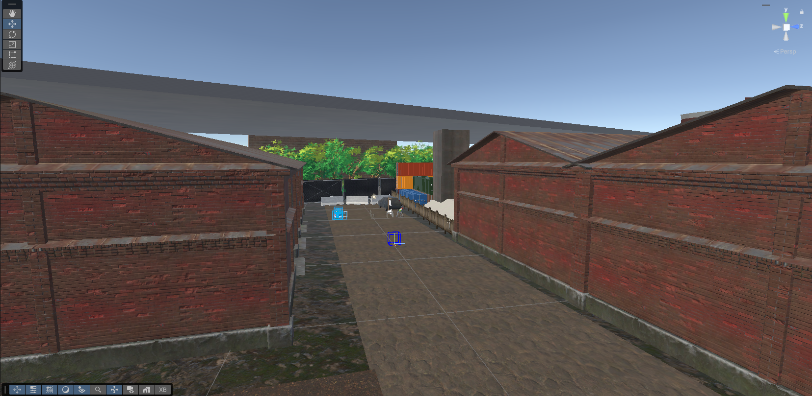
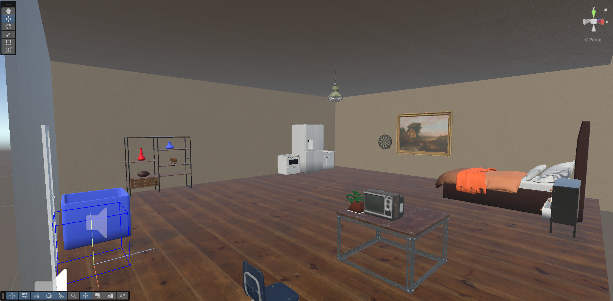
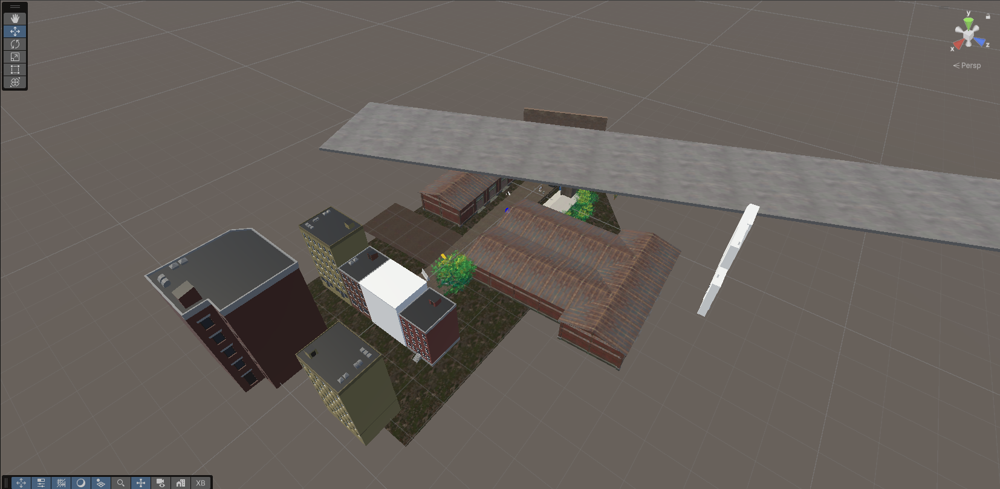
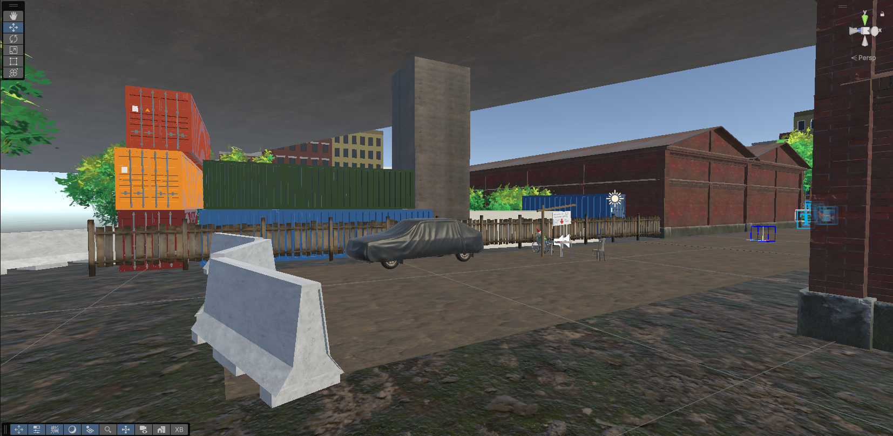
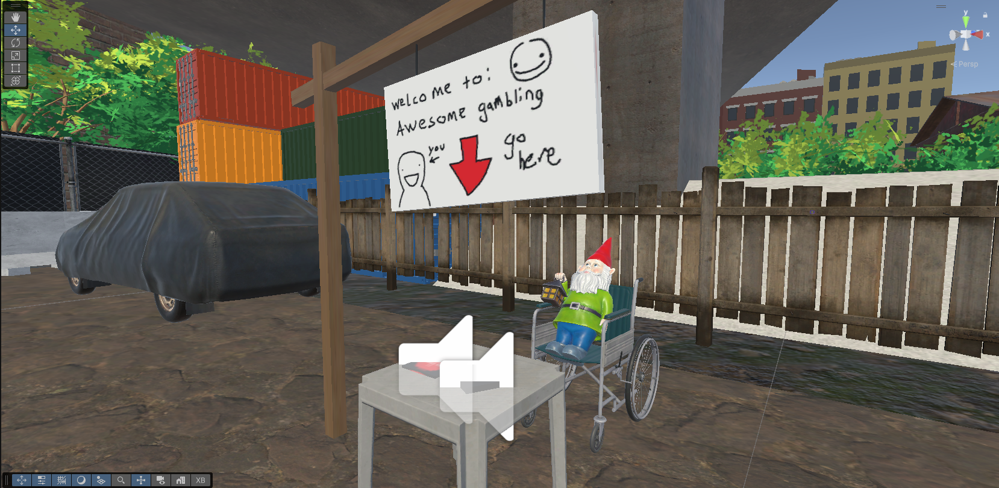

My project is all about participating in an interactive scenario. While the game focuses on the central gimmick of gambling, there are other tasks to be endulged in. Walking around the environment and visiting the apartment scene help flesh out the world of the game and help the user feel immersed. 

The extra skill that I worked on during this project was programming. There are six scripts for this project, and trying to get them all to work was frustrating. The code was made with the assistance of Microsoft Copilot and helps track the wallet, functional coin flips, and selling items. 

The largest challenge I had to overcome was decorating the environment. As it takes place in the outdoors, it became very difficult to create an immersive scene without obviously showing the ends of the world. To get around this issue, many tricks were utilized to block the player's vision and keep them within a certain area. Many tricks of perspective were used to limit the amount of work put into the environment, trying to reduce it to what is only necessary, for both optimization and deadline based reasons.

Screenshots:

Documentation:
https://assetstore.unity.com/packages/3d/props/exterior/us-road-signs-free-164941
https://assetstore.unity.com/packages/p/free-industrial-building-garage-123146
assetstore.unity.com/packages/p/industrial-models-171071
assetstore.unity.com/packages/p/simple-urban-buildings-pack-1-33563
assetstore.unity.com/packages/p/megapoly-art-containers-197278
assetstore.unity.com/packages/p/free-hut-pack-130776
https://assetstore.unity.com/packages/3d/props/industrial/industrial-props-kit-84745
https://assetstore.unity.com/packages/p/chainlink-fences-73107
https://assetstore.unity.com/packages/3d/environments/anime-nature-276931
assetstore.unity.com/packages/p/yughues-free-bushes-13168
https://assetstore.unity.com/packages/3d/props/furniture/plastic-chair-and-table-set-189695
assetstore.unity.com/packages/p/house-interior-free-258782
assetstore.unity.com/packages/p/free-wood-door-pack-280509
https://polyhaven.com/a/american_football
https://polyhaven.com/a/garden_gnome
https://polyhaven.com/a/carved_wooden_elephant
https://www.youtube.com/watch?v=vNhs9CSI0Vc
https://www.youtube.com/watch?v=o84vJH19toI
https://www.youtube.com/watch?v=-kAtjQOXqd4